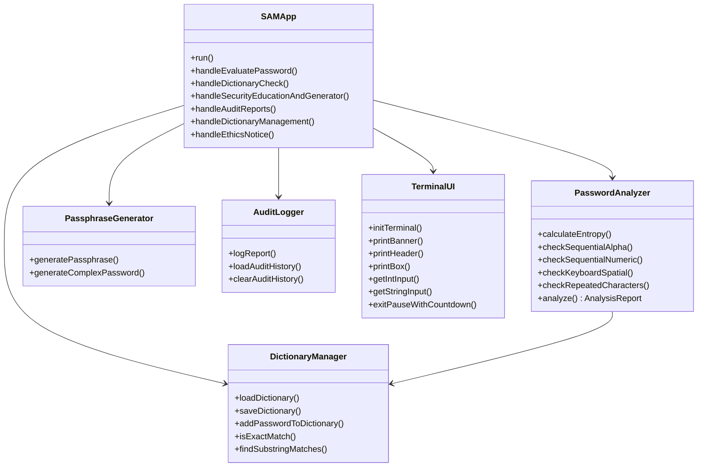

<div align="center">
    
# S.A.M - Secure Auth Monitor

</div>

[](https://isocpp.org/)
[](#)
[](#)
[](#)
[](#)
[](#)
[](#)
[](#)
[](#)
[](#)
[](LICENSE)

<div align="center">

<pre>
███████╗    █████╗    ███╗   ███╗
██╔════╝   ██╔══██╗   ████╗ ████║
███████╗   ███████║   ██╔████╔██║
╚════██║   ██╔══██║   ██║╚██╔╝██║
███████║██╗██║  ██║██╗██║ ╚═╝ ██║
╚══════╝╚═╝╚═╝  ╚═╝╚═╝╚═╝     ╚═╝
Secure Auth Monitor
v1.0.4 | Build 2026.08.02-RELEASE
</pre>

**An Enterprise-Grade Terminal Credential Evaluation & Defensive Security Suite**

</div>

---

## 📌 Overview

**S.A.M (Secure Auth Monitor)** is a high-performance, modular C++ application designed to evaluate authentication credentials against mathematical entropy models, spatial keyboard walks, dictionary breach lists, and consecutive character repetitions.

Built with **C++11**, **Object-Oriented Programming (OOP)**, **ANSI 24-bit TrueColor Terminal Graphics**, and **Privacy-Preserving Audit Logging**, S.A.M provides both interactive cybersecurity awareness and real-time defensive feedback.

---

## ✨ Key Features

- **🧮 Shannon Entropy Calculation**: Evaluates password randomness in bits ($H = L \cdot \log_2 N$) across 4 character pools (uppercase, lowercase, digits, symbols).
- **🔍 Dictionary Vulnerability Checker**: Cross-references candidate passwords against dictionary wordlists (`rockyou.txt`) with exact-match and sub-phrase detection.
- **⌨️ Spatial & Keyboard Walk Detector**: Identifies sequential patterns (`1234`, `abc`, `qwerty`, `asdf`) and repeated character sequences with automatic sub-pattern pruning.
- **🎲 Cryptographic Passphrase Generator**: Uses `std::mt19937` to generate high-entropy multi-word passphrases with custom separators and random symbols.
- **🔒 Privacy-Preserving Audit Logger**: Writes evaluation logs to `analysis_report.txt` using mandatory character masking (`P**********!`) to protect credential privacy.
- **🎨 ANSI 24-Bit Linear RGB Gradient UI**: Custom terminal UI featuring linear color gradients, Summer Sky highlight accents, high-contrast badges, and interactive non-blocking 10-second countdown timers.
- **📚 Integrated Security Education**: Displays NIST SP 800-63B guidelines and best-practice password defense recommendations.

---

## 📐 System Architecture



---

## 🚀 Quick Start & Compilation

### Prerequisites
- C++11 compliant compiler (GCC / MinGW / Clang / MSVC)
- Windows PowerShell / Command Prompt / Linux Terminal supporting ANSI escape codes

### Build Instructions

#### Option 1: Direct GCC Compilation (Recommended)
```bash
g++ -std=c++11 -O2 -o sam.exe TerminalUI.cpp DictionaryManager.cpp PasswordAnalyzer.cpp PassphraseGenerator.cpp AuditLogger.cpp SecurityEducation.cpp SAMApp.cpp main.cpp
```

#### Option 2: Dev-C++ / TDM-GCC
Open the project directory in Dev-C++, select **Release (64-bit)** with C++11 ISO standard enabled, and click **Rebuild All (F12)**.

### Execution
```bash
./sam.exe
```

---

## 📁 File Structure

```text
S.A.M/
├── main.cpp                 # Application Entry Point
├── SAMApp.h / .cpp          # Core Application Controller & State Machine
├── TerminalUI.h / .cpp      # ANSI TrueColor Rendering & Terminal Input
├── PasswordAnalyzer.h / .cpp       # Entropy Calculation & Pattern Pruning Engine
├── DictionaryManager.h / .cpp      # Dictionary File I/O & Ascending Sort Engine
├── PassphraseGenerator.h / .cpp    # Random Passphrase & Password Generator
├── AuditLogger.h / .cpp            # Masked Persistent Audit Log Manager
├── SecurityEducation.h / .cpp      # NIST Security Standards & Education Center
├── rockyou.txt                     # Sample Weak Password Dictionary Dataset
├── analysis_report.txt      # Generated Persistent Audit Log File
├── LICENSE                  # MIT License File
└── README.md                # Project Documentation
```

---

## 🧑‍💻 Author & Project Metadata

- **Author**: Muhammad Salman Jawed
- **Dicipline**: Digital Forensics and Cybersecurity 
- **Project**: S.A.M - Secure Auth Monitor
- **Version**: `v1.0.4` | Build `2026.08.02-RELEASE`

---

## 📜 License

This project is licensed under the **MIT License** — see the [LICENSE](LICENSE) file for full details.
